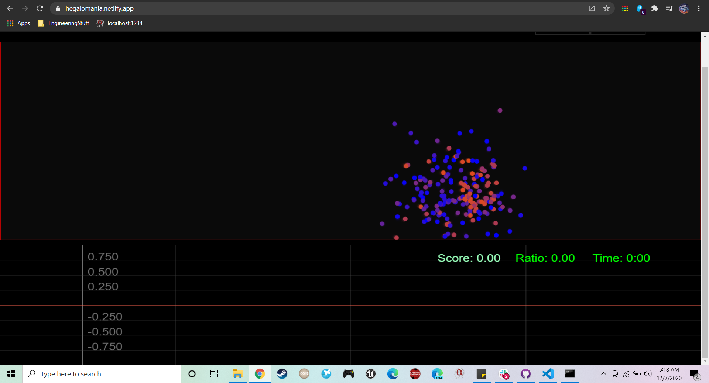

# HEG ESP32 - Delobotomizer Edition

Official repository for the HEGduino V2 Delobotomizer firmware, software, and designs.

### [Installable Web App](https://hegalomania.netlify.app) 
- Work in Progress, use via Chrome for Serial USB support. Find the install button via the settings button in the top right of the browser.
### [Getting Started (click me)](https://github.com/moothyknight/HEG_ESP32_Delobotomizer/blob/main/Guides/GettingStarted.md)
### [Updating Your Device](https://github.com/moothyknight/HEG_ESP32_Delobotomizer/blob/main/Guides/Updating.md)
### [Whitepaper](https://github.com/moothyknight/HEG_ESP32_Delobotomizer/blob/main/Guides/Open%20Source%20HEG_FNIRS%20Whitepaper.pdf)

For now, you can follow along from the [original repo](https://github.com/moothyknight/HEG_ESP32) on how to install the chrome extension. This is being phased out due to the superior PWA format.

## Firmware

The Firmware folder contains a .bin file that you can use via the on-board web interface to update the device. There are Arduino libraries and firmware code files for custom code, you will need the ESP32 module additionally for Arduino.

Simply connect to the wifi network named "My_HEG" when the device is powered up with password "12345678"

In your preferred browser, enter "192.168.4.1" into the address bar. You should see an interface show up. Click on the Update button to go to the update page.

Now follow the instructions on screen to browse for the .bin folder that you may download from this repo. Wait for it to finish uploading then reconnect to the HEG after that's taken care of if it does not do it automatically. Voila!

## Progressive Web App (WIP): https://hegalomania.netlify.app

Our new preferred method for using the HEG, a state of the art Progressive Web App! 

Open this link to use your HEG in a Chrome browser or Android for instant access to using your device. This is being updated to a React app with a more familiar UI and a more concise code base to expand from.

You may install it locally on desktop or mobile as well just like any app and create desktop shortcuts. For desktop open the settings bar in Chrome and click "Install HEG Alpha." The USB mode only works in chrome right now as it is a development feature. You can enable this feature by going to chrome://flags and enabling the "Experimental Web Platform features" flag. For mobile it should prompt you to install, if not find the install button in your chrome settings menu on mobile.

## Boot routine

The new firmware contains a new boot-up routine for making it easier to switch modes on the device. It will flash when powered up to indicate which mode it's in then has a period to let you reset the device into a different mode. You will see a series of rapid flashes then several slow flashes, then you should see the red LED come on finally after 3 seconds from powering up. If you don't see the light come on after it is done booting try rebooting the device via the reset button as there is a known bug when freshly powering the device that the SPI mode won't start.

On boot:
* Two fast blinks: BLE mode
* Three fast blinks: WIFI mode
* Four fast blinks: Bluetooth Classic (Serial) mode

Then reset when:
* Reset before first slow flash: Put device to sleep
* Reset before second slow flash, after first: Change wireless mode (see above)
* Reset before third blink, after second: Reset WiFi credentials (they can get stuck if you enter them incorrectly or if a router won't connect to the device properly)

## Device Commands (accessible via app (Send Command button) or serial monitor)

* 't' - Turn sensor ON (automatic)
* 'f' - Turn sensor OFF, device will go to sleep after 10min of inactivity
* 'b' - BLE mode toggle. Toggles back to WiFi mode.
* 'B' - Bluetooth Serial toggle. Toggles back to WiFi mode.
* 'W' - Reset WiFi credentials (if it won't connect to your router)
* 'R' - Reboot device
* 'S' - Enter deep sleep mode e.g. to save battery
* 'u' - USB only output mode (no wireless signals)
* 'o' - Fast output mode (<20 byte packets for Android Web BLE)
* 'L' - External LED mode, configured for pins 12 and 14 to run LEDs and be sampled.
* 'N' - Toggle SPO2 output (experimental, not working properly yet)
* 'D' - Toggle Debug output (for using Arduino's graphing)
* 'e' - Toggle exposure settings: slow, fast, and default.
* 'l' - Toggle LED protocols: Ambient = 2 IR (LED1, LED2, LED1+2), Red = IR (LED1, LED2), or Default (LED3,LED2,Ambient)
